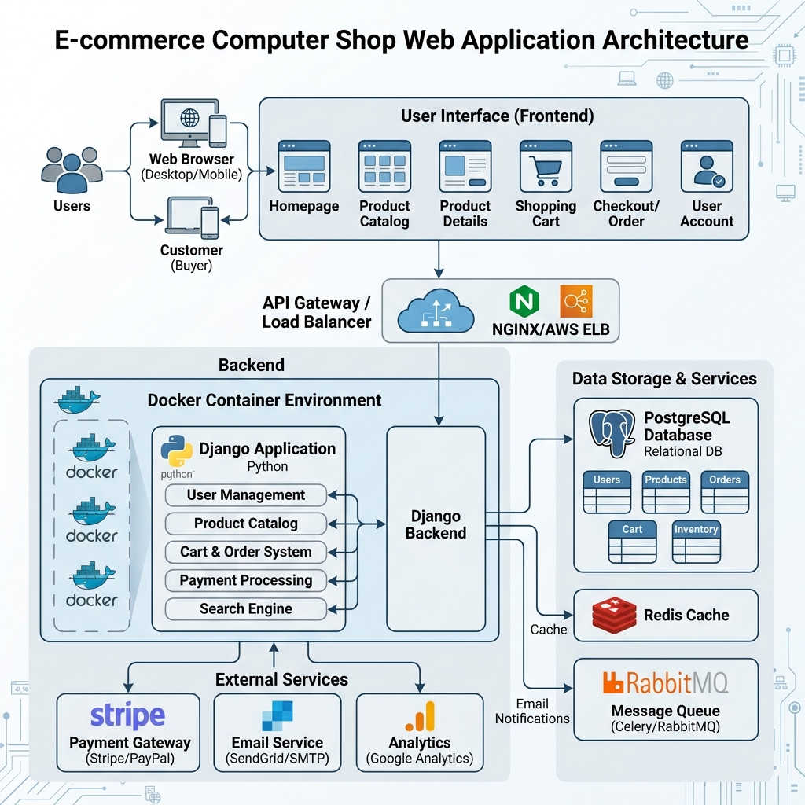
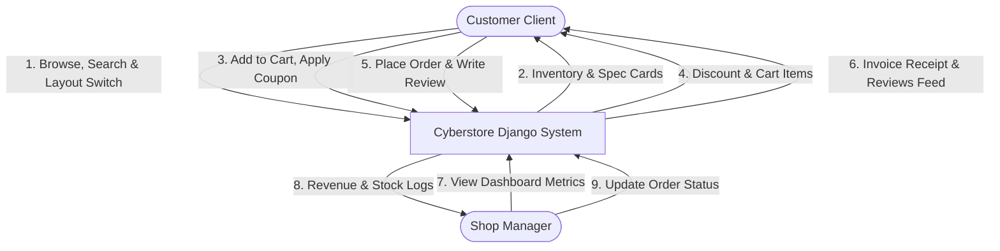
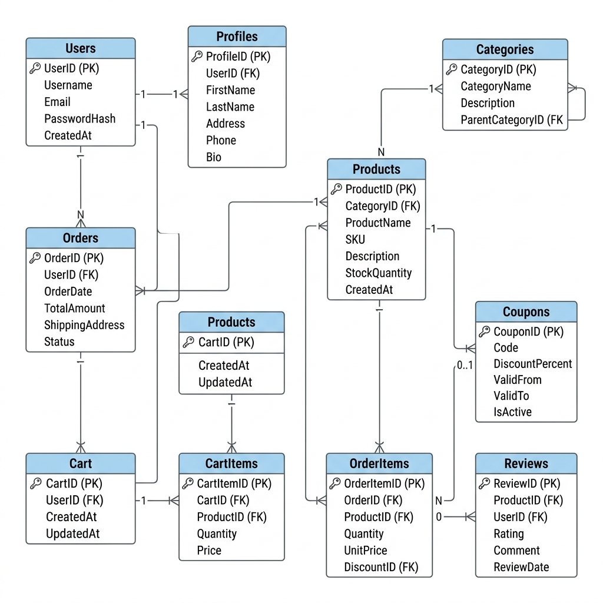
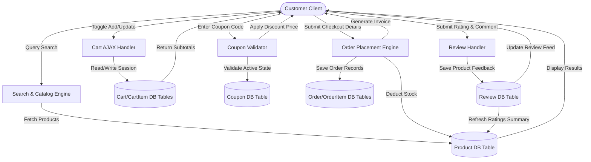

# SYSTEM DOCUMENTATION & PRESENTATION GUIDE: CYBERSTORE
**SETEC INSTITUTE** | **MANAGEMENT INFORMATION SYSTEM**  
**GROUP: PY-DJANGO-SU2** | **Topic:** Cyberstore E-Commerce Platform  
**Subject:** Full-Stack Web Development II (Python & Django)

---

# PART I: PRESENTATION SLIDES (QUICK-PRESENT SUMMARY)
*Use this section directly for your class presentation. Each slide is designed to be clear, visual, and easy to read.*

---

## 📺 Slide 1: Project Overview & Core Mission
* **Platform Name**: Cyberstore E-Commerce (Computer Shop)
* **Design Reference**: Inspired by Cambodia’s premium hardware retailers (e.g. *vtech-computer.com*).
* **The Goal**: Create a state-of-the-art e-commerce site for PC builders with dynamic frontend controls and a secure management dashboard.
* **Key Features**:
  * 🏷️ Hover mega-menus for categories.
  * 🎛️ Dynamic 2, 3, 4, or 5-column grid layout switcher.
  * 📈 Real-time inventory progress bars ("Available" vs. "Sold").
  * 🎟️ Cart promo coupon code validation.
  * 💬 Customer star ratings and text reviews feed.

---

## 📺 Slide 2: Tech Stack & System Architecture
* **Container Environment**: Fully dockerized using `docker-compose`.
* **Backend Engine**: **Python & Django** handling request routing, security, and views.
* **Data Storage**: **PostgreSQL** relational database.
* **UI Interface**: Custom **Vanilla CSS & JS** for fast, clean, and responsive interfaces.
* **Architecture Diagram**:
  *(A modern layout linking Web Clients, Docker Containers, PostgreSQL, and external services)*

  

---

## 📺 Slide 3: Functional Scope (Who Can Do What?)
* **1. Customer Experience**:
  * Browse catalog with AJAX search (instant search filters without page refresh).
  * Adjust card grids instantly via toolbar button togglers.
  * Drag cart drawer slide-out, adjust item quantity, and apply active discount coupons.
  * Place order via Cash on Delivery (COD) and view structured invoice receipts.
  * Register, login, and submit star reviews/comments on products.
* **2. Shop Manager Dashboard**:
  * Monitor business revenue, total orders count, and pending orders.
  * Receive visual warnings for low stock items (warnings for stock $\le$ 5).
  * Process delivery states (Pending, Processing, Completed, Cancelled).

---

## 📺 Slide 4: Data Flow Diagram (DFD Level 0)
* **Customer Client**: Browse items, add to cart, apply coupon, place order, and write reviews.
* **Shop Manager**: View sales metric dashboards and update order delivery statuses.
* **System Admin**: Manage catalog categories, product models, and coupon codes.



---

## 📺 Slide 5: Database Relationship Diagram (ERD)
* **Relational Schema**: 10 interconnected tables representing users, items, and transactions.
* **Core Relations**:
  * `Category` contains multiple `Products`.
  * `User` places `Orders`, writes `Reviews`, and owns a `Cart`.
  * `Cart` holds `CartItems`, `Order` holds `OrderItems`.
  * `Coupon` applies percentage discounts to orders.

  

---

## 📺 Slide 6: Economic Feasibility & Cost Breakdown
* **Development Budget**: Est. **$3,730** total (salaries, EC2/RDS deployment, SSL security domain certificates, utilities).
* **Hardware Requirements**: Minimum 2 Cores CPU, 4 GB RAM, 40 GB SSD storage, Docker runtime.
* **Timeline & Sprints**:
  * **Sprint 1**: Product filters, category menus, and interactive AJAX cart drawer.
  * **Sprint 2**: Cash on Delivery checkout, customer profile registration, and dashboard revenue logs.
  * **Sprint 3**: Promo coupons discount engine, product reviews, and grid layout switcher.

---

## 📺 Slide 7: Quality Assurance & Test Verification
* **Test Automation**: 9 unit tests checking cart subtotals, catalog rendering, coupon discounts, order creation, reviews saving, and manager dashboard locks.
* **Result**: **100% PASS** on all test cases!
* **Robust Verification**: Tested in isolated test databases before production build.

---

# PART II: COMPREHENSIVE TECHNICAL REFERENCE

---

## II. System Requirements

### 1. Functional Scope by User Roles
* **Customer (Anonymous or Authenticated):**
  * Browse and search products via dynamic AJAX filtering (without page reloads).
  * Adjust product catalog layouts on-the-fly using 2, 3, 4, or 5-column grid selectors.
  * View product specifications, average star ratings, stock availability, and client review feeds.
  * Add items, update quantities, or delete items in the interactive sliding cart drawer.
  * Apply promotional coupon codes (e.g. `CYBERGPU`, `CYBER10`) to calculate cart discounts.
  * Checkout order using Cash on Delivery (COD) and receive a structured order invoice.
  * Create accounts, manage billing profiles, and submit ratings/reviews on purchased products.
* **Shop Manager:**
  * Access the secure custom Management Dashboard.
  * View sales metrics (Total Revenue from completed orders, total orders, pending orders).
  * Monitor low stock items (warnings for products with stock levels $\le$ 5).
  * Process client orders and modify delivery statuses (Pending, Processing, Completed, Cancelled).
* **IT Support / System Administrator:**
  * Access Django's built-in Admin panel.
  * Run migrations, handle database configuration, and manage product listings and categories.

### 2. Non-Functional Scope
1. **Usability**: Highly responsive mobile-friendly theme styled with Outfit typography, clean grid cards, and transition effects.
2. **Performance**: AJAX-backed cart updates and product lookups with debounced key-event delays of 300ms.
3. **Security**: Django CSRF token middleware protection on all POST endpoints, and password encryption hashing.
4. **Scalability**: Separate containers for Web and DB services allow horizontal scaling.
5. **Availability**: Healthy health-checks for PostgreSQL containers, ensuring the web application is served continuously.

---

## III. Economic Feasibility

### 1. Development Budget Estimates

| Cost Category | Description | Rate / Monthly Cost | Total Cost |
| :--- | :--- | :--- | :--- |
| **Developer Salaries** | 3 Developers for 2 Months | $500 / month per dev | $3,000.00 |
| **Hosting Server** | AWS EC2 & RDS DB Instances | $50 / month for 12 months | $600.00 |
| **Security & Domain** | SSL Certificate & Custom Domain | Flat fee | $50.00 |
| **Power & Utilities** | Internet connection and electric power | $40 / month | $80.00 |
| **Grand Total** | **Project Development Budget** | | **$3,730.00** |

### 2. Deployment Hardware Specifications

| Hardware Component | Minimum Requirement | Recommended Specification |
| :--- | :--- | :--- |
| **Processor** | Intel Xeon vCPU or AMD EPYC (2 Cores) | 4 Cores or higher |
| **Memory** | 4 GB DDR4 RAM | 8 GB DDR4 RAM |
| **Storage** | 40 GB SSD Storage | 80 GB NVMe SSD |
| **Operating System** | Ubuntu 22.04 LTS (x86_64) | Ubuntu 24.04 LTS (x86_64) |
| **Engine Runtime** | Docker Engine v24.0+ | Docker Engine v26.0+ |

---

## IV. Function and Task Breakdown

| User Role | Function | Task | Subtask | Duration (Min) |
| :--- | :--- | :--- | :--- | :--- |
| **Customer** | Browse Products | View Home Page | Load featured hardware slides & promos | 120 |
| | | Catalog Filtering | Search search box, category list, & brands | 240 |
| | | Grid Layout Toggle | Switch columns layout (2, 3, 4, or 5 cols) | 120 |
| | Cart Management | Add to Cart | AJAX click to append items with custom Qty | 180 |
| | | Adjust Quantity | Add/subtract quantities inside drawer | 120 |
| | Checkout | Apply Coupon | Input code & validate percentage discount | 120 |
| | | Place Order | Form details entry & COD validation | 180 |
| | Product Feedback | Write Review | Submit star rating (1-5) and feedback comment | 180 |
| **Manager** | Reporting | View Revenue | Display total completed sales | 120 |
| | | Stock Monitoring | Display products $\le$ 5 stock alert | 120 |
| | Order Processing | Edit Order State | Dropdown change (Completed/Cancelled) | 180 |
| **Admin** | Catalog Admin | Category CRUD | Admin panel categories listing | 120 |
| | | Product CRUD | Create items with specifications | 180 |
| | Systems | DB Backup | Export sql dump from pg_dump | 120 |

---

## V. Data Flow Diagrams (Detailed Level 1)


---

## VI. Database Relational Structure
```mermaid
erDiagram
    User ||--o1 UserProfile : "has profile"
    User ||--o{ Cart : "owns"
    User ||--o{ Order : "places"
    User ||--o{ Review : "writes"
    Category ||--o{ Product : "contains"
    Product ||--o{ CartItem : "added in"
    Product ||--o{ OrderItem : "purchased as"
    Product ||--o{ Review : "receives"
    Cart ||--o{ CartItem : "holds"
    Order ||--o{ OrderItem : "details"
    Coupon ||--o{ Order : "applied to"

    User {
        int id PK
        string username
        string email
        string password
    }
    UserProfile {
        int id PK
        int user_id FK
        string phone
        text address
        string city
        string country
        boolean is_manager
    }
    Category {
        int id PK
        string name
        string slug
        text description
    }
    Product {
        int id PK
        int category_id FK
        string name
        string slug
        string sku
        string brand
        text description
        decimal price
        int stock
        json specifications
        string image_url
        image image
        boolean is_active
        datetime created_at
    }
    Cart {
        int id PK
        int user_id FK "nullable"
        string session_key "nullable"
        datetime created_at
    }
    CartItem {
        int id PK
        int cart_id FK
        int product_id FK
        int quantity
    }
    Order {
        int id PK
        int user_id FK "nullable"
        string full_name
        string email
        string phone
        text address
        string city
        string country
        decimal total_amount
        int coupon_id FK "nullable"
        decimal discount_amount
        string status
        boolean is_paid
        datetime created_at
        datetime updated_at
    }
    OrderItem {
        int id PK
        int order_id FK
        int product_id FK
        decimal price
        int quantity
    }
    Coupon {
        int id PK
        string code
        int discount_percent
        boolean is_active
    }
    Review {
        int id PK
        int product_id FK
        int user_id FK
        int rating
        text comment
        datetime created_at
    }
```

---

## VII. Data Dictionary

### 1. UserProfile Table
Stores billing information and user management privileges.

| Column Name | Data Type | PK | Allow Null | Description |
| :--- | :--- | :--- | :--- | :--- |
| `id` | INT | Yes | No | Auto-incrementing primary key. |
| `user_id` | INT | No | No | Foreign Key pointing to User table. |
| `phone` | VARCHAR(20) | No | Yes | Phone number for contact. |
| `address` | TEXT | No | Yes | Detailed shipping address. |
| `city` | VARCHAR(100) | No | Yes | City location. |
| `country` | VARCHAR(100) | No | Yes | Country location (default: Cambodia). |
| `is_manager` | BOOLEAN | No | No | Grants access to Manager Dashboard if True. |

### 2. Category Table
Organizes computer parts catalog.

| Column Name | Data Type | PK | Allow Null | Description |
| :--- | :--- | :--- | :--- | :--- |
| `id` | INT | Yes | No | Primary key. |
| `name` | VARCHAR(100) | No | No | Unique name of the category (e.g. CPUs, GPUs). |
| `slug` | VARCHAR(100) | No | No | URL-friendly unique slug. |
| `description` | TEXT | No | Yes | General category details. |

### 3. Product Table
Stores details of computer components and systems.

| Column Name | Data Type | PK | Allow Null | Description |
| :--- | :--- | :--- | :--- | :--- |
| `id` | INT | Yes | No | Primary key. |
| `category_id`| INT | No | No | Foreign Key pointing to Category. |
| `name` | VARCHAR(255) | No | No | Display name of the product. |
| `slug` | VARCHAR(255) | No | No | URL-friendly unique slug identifier. |
| `sku` | VARCHAR(100) | No | No | Stock Keeping Unit (unique code). |
| `brand` | VARCHAR(100) | No | Yes | Manufacturer brand name (e.g. Apple, Dell, Lenovo). |
| `description` | TEXT | No | No | Long specifications details. |
| `price` | DECIMAL(10,2)| No | No | Retail price of product. |
| `stock` | INT | No | No | Units available in inventory. |
| `specifications`| JSON | No | No | Key-value pairs for technical specifications. |
| `image_url` | VARCHAR(1000)| No | Yes | Hotlink path to product graphics. |
| `image` | VARCHAR(100) | No | Yes | Upload path to local media storage files. |
| `is_active` | BOOLEAN | No | No | Product visibility control flag. |
| `created_at` | DATETIME | No | No | Date and time the product was created. |

### 4. Cart Table
Tracks temporary user cart references.

| Column Name | Data Type | PK | Allow Null | Description |
| :--- | :--- | :--- | :--- | :--- |
| `id` | INT | Yes | No | Primary key. |
| `user_id` | INT | No | Yes | FK referencing User table (for authenticated user). |
| `session_key`| VARCHAR(255)| No | Yes | Unique key mapping guest user session in browser. |
| `created_at` | DATETIME | No | No | Timestamp when cart was created. |

### 5. CartItem Table
Lines added inside active carts.

| Column Name | Data Type | PK | Allow Null | Description |
| :--- | :--- | :--- | :--- | :--- |
| `id` | INT | Yes | No | Primary key. |
| `cart_id` | INT | No | No | FK referencing the parent Cart. |
| `product_id` | INT | No | No | FK referencing the added Product. |
| `quantity` | INT | No | No | Number of items added (positive integer). |

### 6. Order Table
Client shipping details and payment fulfillment status.

| Column Name | Data Type | PK | Allow Null | Description |
| :--- | :--- | :--- | :--- | :--- |
| `id` | INT | Yes | No | Primary key. |
| `user_id` | INT | No | Yes | FK to User table if completed by authenticated user. |
| `full_name` | VARCHAR(255) | No | No | Recipient's full name. |
| `email` | VARCHAR(254) | No | No | Email address for invoices. |
| `phone` | VARCHAR(20) | No | No | Delivery contact number. |
| `address` | TEXT | No | No | Shipping delivery location. |
| `city` | VARCHAR(100) | No | No | City destination. |
| `country` | VARCHAR(100) | No | No | Country destination (default: Cambodia). |
| `total_amount`| DECIMAL(10,2)| No | No | Final purchase price of order items. |
| `coupon_id` | INT | No | Yes | FK to Coupon table if discount code was used. |
| `discount_amount`| DECIMAL(10,2)| No | No | Total discount deducted (default: 0.00). |
| `status` | VARCHAR(20) | No | No | Choices: Pending, Processing, Completed, Cancelled. |
| `is_paid` | BOOLEAN | No | No | Payment collection status flag. |
| `created_at` | DATETIME | No | No | Date and time order was placed. |
| `updated_at` | DATETIME | No | No | Last update timestamp. |

### 7. OrderItem Table
Individual products purchased inside a completed Order.

| Column Name | Data Type | PK | Allow Null | Description |
| :--- | :--- | :--- | :--- | :--- |
| `id` | INT | Yes | No | Primary key. |
| `order_id` | INT | No | No | FK pointing to parent Order. |
| `product_id` | INT | No | No | FK pointing to purchased Product. |
| `price` | DECIMAL(10,2)| No | No | Price of the product at time of purchase. |
| `quantity` | INT | No | No | Purchased quantity. |

### 8. Coupon Table
Stores percentage discount coupon codes.

| Column Name | Data Type | PK | Allow Null | Description |
| :--- | :--- | :--- | :--- | :--- |
| `id` | INT | Yes | No | Primary key. |
| `code` | VARCHAR(50) | No | No | Unique discount text code (e.g. CYBER10). |
| `discount_percent`| INT | No | No | Percentage value of discount (e.g. 10). |
| `is_active` | BOOLEAN | No | No | Flag indicating if coupon is currently valid. |

### 9. Review Table
Holds star ratings and comments left by customers.

| Column Name | Data Type | PK | Allow Null | Description |
| :--- | :--- | :--- | :--- | :--- |
| `id` | INT | Yes | No | Primary key. |
| `product_id` | INT | No | No | FK pointing to the rated Product. |
| `user_id` | INT | No | No | FK pointing to the User who wrote it. |
| `rating` | INT | No | No | Star rating value (restricted 1 to 5 stars). |
| `comment` | TEXT | No | No | Detailed customer review feedback text. |
| `created_at` | DATETIME | No | No | Review submission timestamp. |

---

## VIII. User Interface Design

### 1. Theme Configuration (Vanilla CSS Settings)
* **Colors**: Cyberstore base theme balances high-contrast white card modules (`#ffffff`) and dark-navy banners (`#0d2137`) for a professional premium look. Green accent highlights (`#16a34a`), red brand flags (`#dc2626`), and orange hot deals badges (`#ea580c`) are utilized.
* **Typography**: Google Font **Outfit** is loaded globally for all headings, pricing tables, and UI cards.
* **Grid Systems**: Column variables switch cards dynamically. The product showcase grid transitions smoothly from two columns up to five columns depending on toolbar selector states.

### 2. Client Pages & Manager Panels
* **Navigation Mega-Menu**: Features a vertical category drawer mapping Desktops, Laptops, CPUs, GPUs, RAM, Monitors, Accessories, and Storage. Hovering on categories expands structured fly-out mega menus detailing subcategories and tech brands.
* **Dynamic Catalog Grid**: Integrates grid column selectors (`2`, `3`, `4`, `5`), page sizes dropdown options, search keyword AJAX filters, and an inventory progress meter indicating stock levels and sold ratios.
* **Redesigned Details page**: Incorporates a horizontal two-column split. The left holds product image viewpoints and gallery selectors. The right structures dynamic specifications, fire stickers, +/- quantity button toggles, cart buttons, and reviews feed cards.
* **Checkout & Success Form**: Cart Drawer slides out from the right showing active coupon discount fields. Checkout pages detail custom invoice receipts upon Cash on Delivery completion.

---

## IX. Test Cases

| Test Case ID | Function | Test Case Description | Preconditions | Test Steps | Expected Result | Status |
| :--- | :--- | :--- | :--- | :--- | :--- | :--- |
| **TC001** | User Login | Authenticate with valid username and password. | User has a valid registered account. | 1. Go to Login page.<br>2. Input correct details.<br>3. Click Sign In. | Redirected to Home page; showing welcome welcome alert. | Pass |
| **TC002** | User Login | Fail authentication with empty credentials. | User is on login page. | 1. Leave fields blank.<br>2. Click Sign In. | Display validation error message: "Username and password required". | Pass |
| **TC003** | Auth Access | Redirect standard customer trying to load manager dashboard. | User logged in as a normal customer account. | 1. Request URL `/dashboard/`. | Redirected back to Home with error message: "Access denied." | Pass |
| **TC004** | Auth Access | Access manager dashboard as authorized user. | User logged in as manager account (`admin`). | 1. Request URL `/dashboard/`. | Access granted. Displays dashboard statistics page. | Pass |
| **TC005** | Catalog | Search components using search input. | Products exist in database. | 1. Navigate to Catalog.<br>2. Type "RTX" in search box. | Grid updates instantly showing only "ASUS ROG Strix RTX 4080 GPU". | Pass |
| **TC006** | Catalog | Filter products by Category list. | Category lists exist. | 1. Navigate to Catalog.<br>2. Click "CPUs" tag. | Grid filters to show only CPU listings. | Pass |
| **TC007** | Shopping Cart| Add new product to shopping cart drawer. | Product is in stock. | 1. Click "Add to Cart" on a product. | Cart drawer slides open displaying item, price, and updated totals. | Pass |
| **TC008** | Shopping Cart| Change item quantities from cart controls. | Items already in cart. | 1. Click "+" icon on cart item. | Quantity increments, subtotal and badge count recalculate instantly. | Pass |
| **TC009** | Shopping Cart| Remove item from shopping cart. | Items already in cart. | 1. Click trash icon next to item. | Item fades out; totals are updated. | Pass |
| **TC010** | Checkout | Submit checkout form with valid details. | Items present in cart. | 1. Click Checkout.<br>2. Complete form fields.<br>3. Place order. | Redirected to success page showing order ID and invoice details. | Pass |
| **TC011** | Inventory | Deduct inventory stock levels after checkout. | Product has stock = 15. | 1. Buy 2 units of product.<br>2. Check admin or database stock. | Product stock level drops to 13. | Pass |
| **TC012** | Dashboard | Display warning alerts for items with low stock. | Product stock is 2. | 1. Log in as manager (`admin`).<br>2. View Dashboard. | Product listed in "Inventory Stock Warnings" with a crimson warning text. | Pass |
| **TC013** | Coupons | Apply promo code during checkout. | Active coupons `CYBERGPU` exist. | 1. Open checkout cart.<br>2. Input "CYBERGPU" into coupon box.<br>3. Click Apply. | 10% discount is applied. Total amount is recalculated and displays deducted sum. | Pass |
| **TC014** | Reviews | Write and submit a product review. | Customer is logged in, and product exists. | 1. Open product details page.<br>2. Input 5 stars and text comment.<br>3. Click Submit Review. | Review is saved in database and instantly displayed in the review feed. | Pass |

---

## X. Product Backlog

| ID | User Story | Story Points | Priority | Sprint | Status |
| :--- | :--- | :--- | :--- | :--- | :--- |
| **1** | As a **Manager**, I want to view business revenue and low-stock alerts. | 8 | High | 1 | Completed |
| **2** | As a **Customer**, I want to search and filter products dynamically. | 5 | High | 1 | Completed |
| **3** | As a **Customer**, I want an interactive cart drawer with AJAX operations. | 5 | High | 1 | Completed |
| **4** | As a **Customer**, I want to place order invoices via Cash on Delivery. | 8 | High | 2 | Completed |
| **5** | As a **Manager**, I want to update client order statuses. | 3 | Medium | 2 | Completed |
| **6** | As a **System Admin**, I want a seeded Postgres database on Docker environment. | 5 | Medium | 2 | Completed |
| **7** | As a **Customer**, I want to register and login securely. | 5 | Medium | 2 | Completed |
| **8** | As a **Customer**, I want to apply promotional discount coupons to my cart. | 5 | Medium | 3 | Completed |
| **9** | As a **Customer**, I want to review and rate hardware components I've bought. | 5 | Medium | 3 | Completed |
| **10**| As a **Customer**, I want to adjust product layout columns dynamically. | 3 | Low | 3 | Completed |
